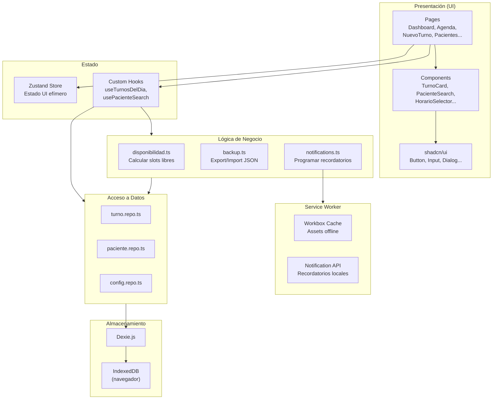

# Diagrama de Componentes

```mermaid
graph TB
    subgraph UI["Presentación (UI)"]
        Pages["Pages<br/>Dashboard, Agenda,<br/>NuevoTurno, Pacientes..."]
        Components["Components<br/>TurnoCard, PacienteSearch,<br/>HorarioSelector..."]
        ShadcnUI["shadcn/ui<br/>Button, Input, Dialog..."]
    end

    subgraph State["Estado"]
        Zustand["Zustand Store<br/>Estado UI efímero"]
        Hooks["Custom Hooks<br/>useTurnosDelDia,<br/>usePacienteSearch"]
    end

    subgraph Business["Lógica de Negocio"]
        DisponibilidadSvc["disponibilidad.ts<br/>Calcular slots libres"]
        BackupSvc["backup.ts<br/>Export/Import JSON"]
        NotificationsSvc["notifications.ts<br/>Programar recordatorios"]
    end

    subgraph Data["Acceso a Datos"]
        TurnoRepo["turno.repo.ts"]
        PacienteRepo["paciente.repo.ts"]
        ConfigRepo["config.repo.ts"]
    end

    subgraph Storage["Almacenamiento"]
        Dexie["Dexie.js"]
        IndexedDB["IndexedDB<br/>(navegador)"]
    end

    subgraph Worker["Service Worker"]
        Cache["Workbox Cache<br/>Assets offline"]
        Notifs["Notification API<br/>Recordatorios locales"]
    end

    Pages --> Components
    Components --> ShadcnUI
    Pages --> Hooks
    Pages --> Zustand
    Hooks --> Business
    Hooks --> Data
    Business --> Data
    Data --> Dexie
    Dexie --> IndexedDB
    NotificationsSvc --> Worker
```
