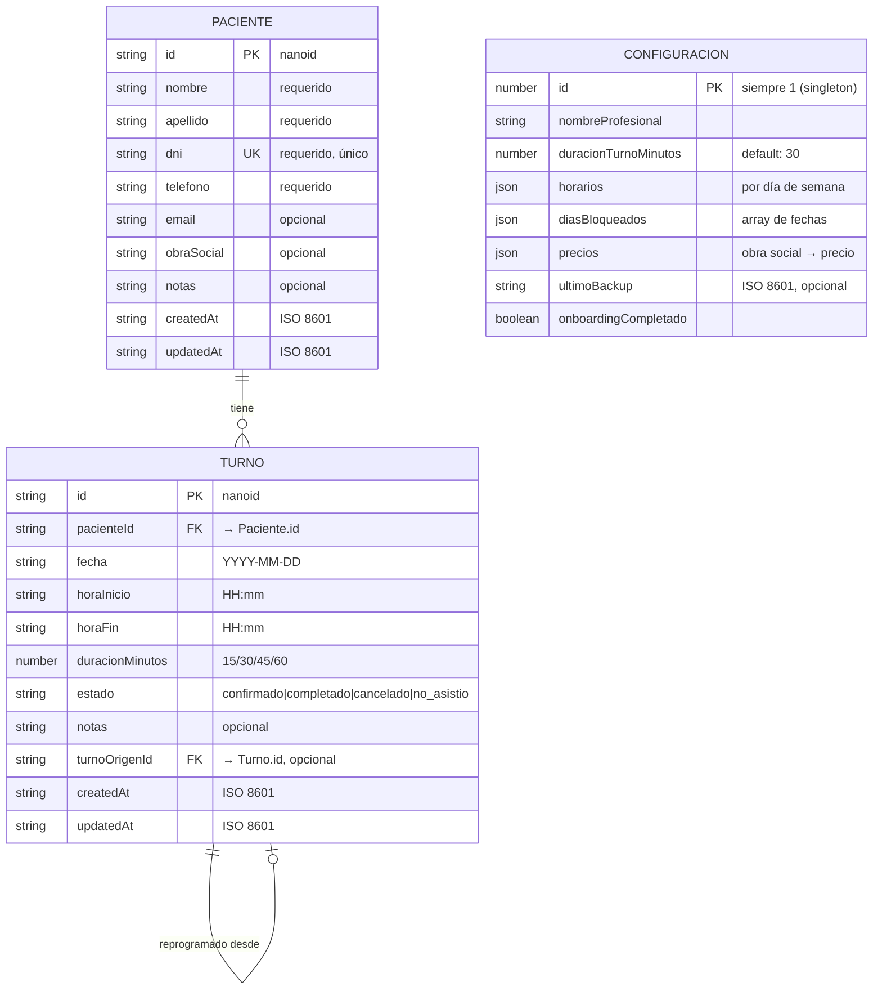

# Diagrama Entidad-Relación

**Relaciones:**
- **Paciente → Turno**: 1 a muchos. Un paciente puede tener múltiples turnos.
- **Turno → Turno** (self-reference): opcional. Un turno reprogramado referencia al turno original via `turnoOrigenId`.
- **Configuración**: singleton (siempre id=1), sin relaciones.
