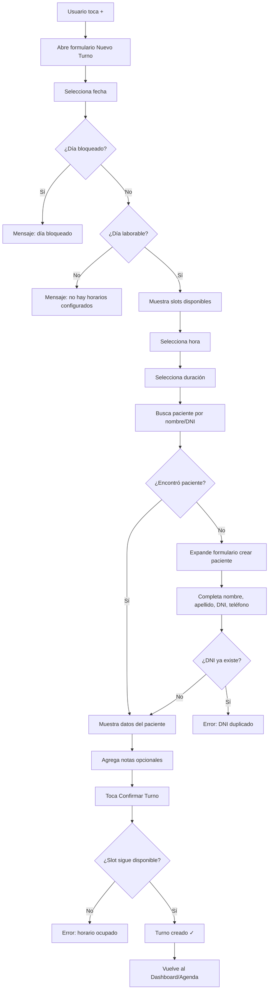

# Flowchart: Crear Turno

```mermaid
flowchart TD
    A[Usuario toca +] --> B[Abre formulario Nuevo Turno]
    B --> C[Selecciona fecha]
    C --> D{¿Día bloqueado?}
    D -->|Sí| E[Mensaje: día bloqueado]
    D -->|No| F{¿Día laborable?}
    F -->|No| G[Mensaje: no hay horarios configurados]
    F -->|Sí| H[Muestra slots disponibles]
    H --> I[Selecciona hora]
    I --> J[Selecciona duración]
    J --> K[Busca paciente por nombre/DNI]
    K --> L{¿Encontró paciente?}
    L -->|Sí| M[Muestra datos del paciente]
    L -->|No| N[Expande formulario crear paciente]
    N --> O[Completa nombre, apellido, DNI, teléfono]
    O --> P{¿DNI ya existe?}
    P -->|Sí| Q[Error: DNI duplicado]
    P -->|No| M
    M --> R[Agrega notas opcionales]
    R --> S[Toca Confirmar Turno]
    S --> T{¿Slot sigue disponible?}
    T -->|No| U[Error: horario ocupado]
    T -->|Sí| V[Turno creado ✓]
    V --> W[Vuelve al Dashboard/Agenda]
```
