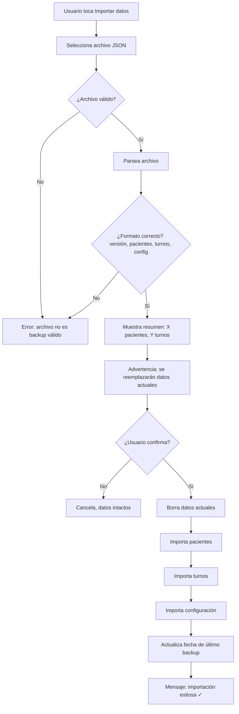

# Flowchart: Importar Backup

```mermaid
flowchart TD
    A[Usuario toca Importar datos] --> B[Selecciona archivo JSON]
    B --> C{¿Archivo válido?}
    C -->|No| D[Error: archivo no es backup válido]
    C -->|Sí| E[Parsea archivo]
    E --> F{¿Formato correcto? versión, pacientes, turnos, config}
    F -->|No| D
    F -->|Sí| G[Muestra resumen: X pacientes, Y turnos]
    G --> H[Advertencia: se reemplazarán datos actuales]
    H --> I{¿Usuario confirma?}
    I -->|No| J[Cancela, datos intactos]
    I -->|Sí| K[Borra datos actuales]
    K --> L[Importa pacientes]
    L --> M[Importa turnos]
    M --> N[Importa configuración]
    N --> O[Actualiza fecha de último backup]
    O --> P[Mensaje: importación exitosa ✓]
```
