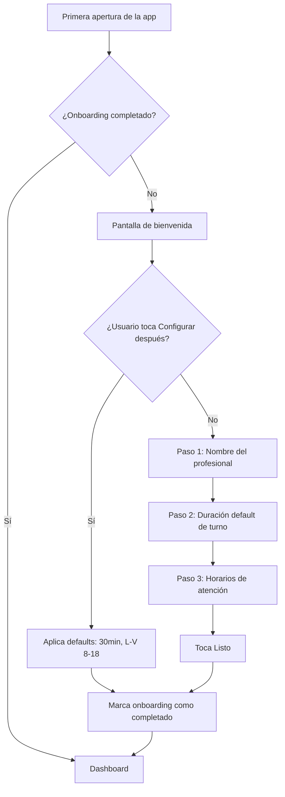

# Flowchart: Onboarding (Primer Uso)

```mermaid
flowchart TD
    A[Primera apertura de la app] --> B{¿Onboarding completado?}
    B -->|Sí| C[Dashboard]
    B -->|No| D[Pantalla de bienvenida]
    D --> E{¿Usuario toca Configurar después?}
    E -->|Sí| F[Aplica defaults: 30min, L-V 8-18]
    F --> G[Marca onboarding como completado]
    G --> C
    E -->|No| H[Paso 1: Nombre del profesional]
    H --> I[Paso 2: Duración default de turno]
    I --> J[Paso 3: Horarios de atención]
    J --> K[Toca Listo]
    K --> G
```
