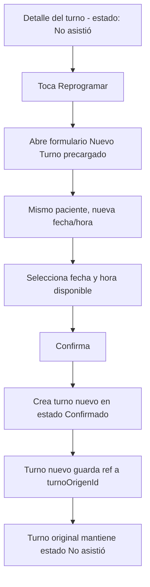

# Flowchart: Reprogramar Turno

```mermaid
flowchart TD
    A[Detalle del turno - estado: No asistió] --> B[Toca Reprogramar]
    B --> C[Abre formulario Nuevo Turno precargado]
    C --> D[Mismo paciente, nueva fecha/hora]
    D --> E[Selecciona fecha y hora disponible]
    E --> F[Confirma]
    F --> G[Crea turno nuevo en estado Confirmado]
    G --> H[Turno nuevo guarda ref a turnoOrigenId]
    H --> I[Turno original mantiene estado No asistió]
```
