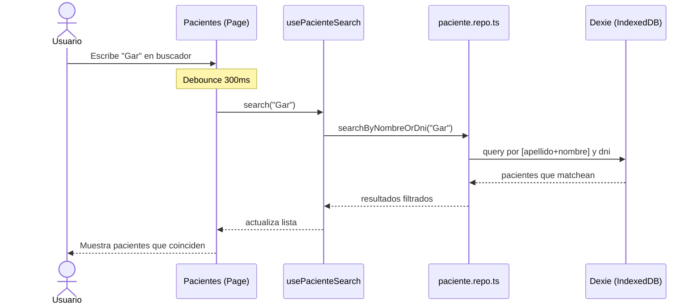

# Diagrama de Secuencia: Buscar Paciente (US-11)

```mermaid
sequenceDiagram
    actor U as Usuario
    participant P as Pacientes (Page)
    participant Hook as usePacienteSearch
    participant PR as paciente.repo.ts
    participant DB as Dexie (IndexedDB)

    U->>P: Escribe "Gar" en buscador
    Note over P: Debounce 300ms
    P->>Hook: search("Gar")
    Hook->>PR: searchByNombreOrDni("Gar")
    PR->>DB: query por [apellido+nombre] y dni
    DB-->>PR: pacientes que matchean
    PR-->>Hook: resultados filtrados
    Hook-->>P: actualiza lista
    P-->>U: Muestra pacientes que coinciden
```
