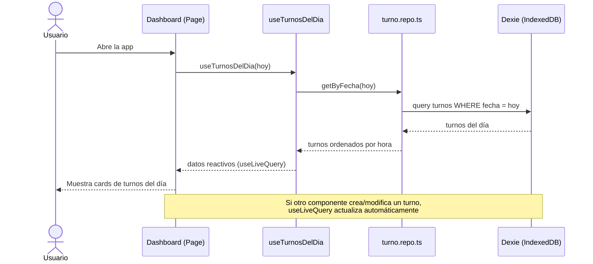

# Diagrama de Secuencia: Cargar Dashboard (US-01)

```mermaid
sequenceDiagram
    actor U as Usuario
    participant D as Dashboard (Page)
    participant Hook as useTurnosDelDia
    participant TR as turno.repo.ts
    participant DB as Dexie (IndexedDB)

    U->>D: Abre la app
    D->>Hook: useTurnosDelDia(hoy)
    Hook->>TR: getByFecha(hoy)
    TR->>DB: query turnos WHERE fecha = hoy
    DB-->>TR: turnos del día
    TR-->>Hook: turnos ordenados por hora
    Hook-->>D: datos reactivos (useLiveQuery)
    D-->>U: Muestra cards de turnos del día

    Note over D,DB: Si otro componente crea/modifica un turno,<br/>useLiveQuery actualiza automáticamente
```
