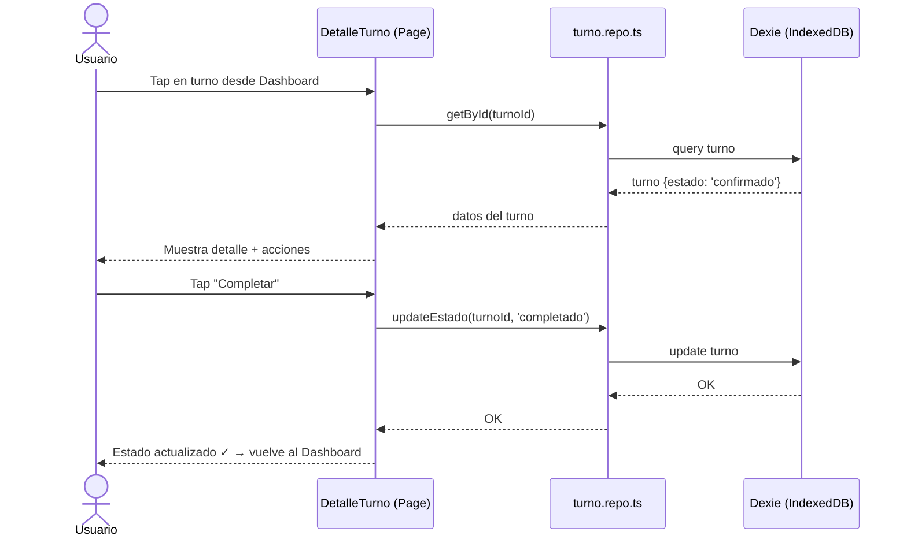

# Diagrama de Secuencia: Marcar Turno como Completado (US-04)

```mermaid
sequenceDiagram
    actor U as Usuario
    participant D as DetalleTurno (Page)
    participant TR as turno.repo.ts
    participant DB as Dexie (IndexedDB)

    U->>D: Tap en turno desde Dashboard
    D->>TR: getById(turnoId)
    TR->>DB: query turno
    DB-->>TR: turno {estado: 'confirmado'}
    TR-->>D: datos del turno
    D-->>U: Muestra detalle + acciones

    U->>D: Tap "Completar"
    D->>TR: updateEstado(turnoId, 'completado')
    TR->>DB: update turno
    DB-->>TR: OK
    TR-->>D: OK
    D-->>U: Estado actualizado ✓ → vuelve al Dashboard
```
