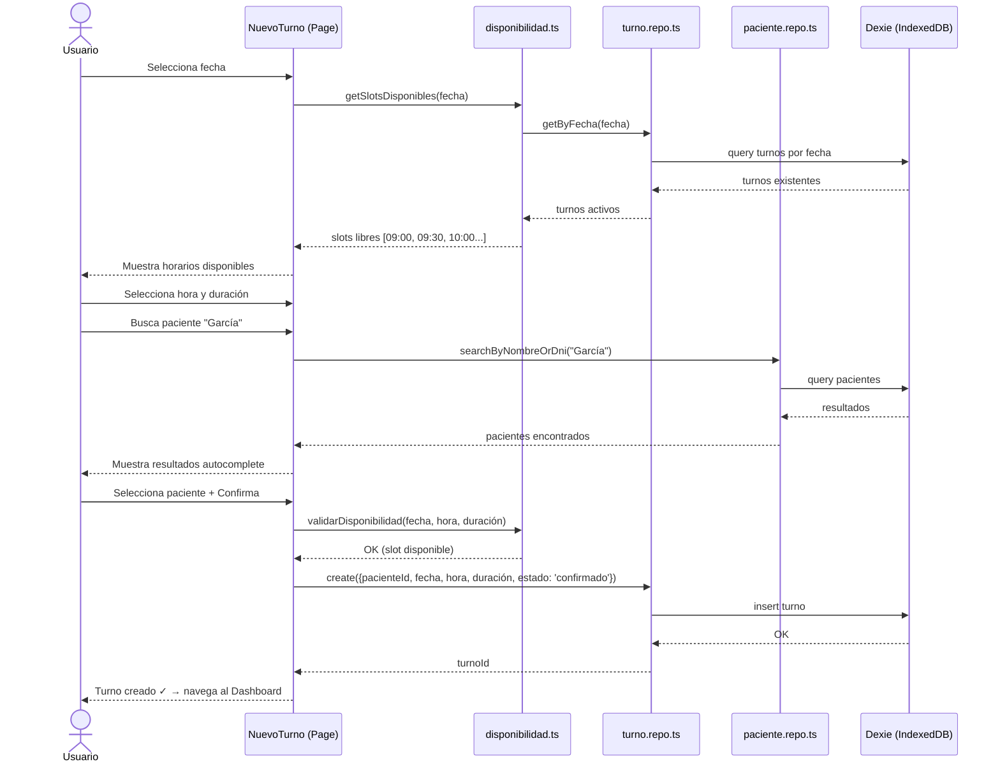

# Diagrama de Secuencia: Crear Turno (US-02)

```mermaid
sequenceDiagram
    actor U as Usuario
    participant P as NuevoTurno (Page)
    participant DS as disponibilidad.ts
    participant TR as turno.repo.ts
    participant PR as paciente.repo.ts
    participant DB as Dexie (IndexedDB)

    U->>P: Selecciona fecha
    P->>DS: getSlotsDisponibles(fecha)
    DS->>TR: getByFecha(fecha)
    TR->>DB: query turnos por fecha
    DB-->>TR: turnos existentes
    TR-->>DS: turnos activos
    DS-->>P: slots libres [09:00, 09:30, 10:00...]
    P-->>U: Muestra horarios disponibles

    U->>P: Selecciona hora y duración
    U->>P: Busca paciente "García"
    P->>PR: searchByNombreOrDni("García")
    PR->>DB: query pacientes
    DB-->>PR: resultados
    PR-->>P: pacientes encontrados
    P-->>U: Muestra resultados autocomplete

    U->>P: Selecciona paciente + Confirma
    P->>DS: validarDisponibilidad(fecha, hora, duración)
    DS-->>P: OK (slot disponible)
    P->>TR: create({pacienteId, fecha, hora, duración, estado: 'confirmado'})
    TR->>DB: insert turno
    DB-->>TR: OK
    TR-->>P: turnoId
    P-->>U: Turno creado ✓ → navega al Dashboard
```
