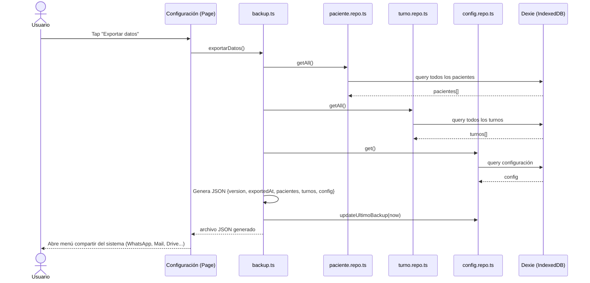

# Diagrama de Secuencia: Exportar Backup (US-24)

```mermaid
sequenceDiagram
    actor U as Usuario
    participant C as Configuración (Page)
    participant BS as backup.ts
    participant PR as paciente.repo.ts
    participant TR as turno.repo.ts
    participant CR as config.repo.ts
    participant DB as Dexie (IndexedDB)

    U->>C: Tap "Exportar datos"
    C->>BS: exportarDatos()
    BS->>PR: getAll()
    PR->>DB: query todos los pacientes
    DB-->>PR: pacientes[]
    BS->>TR: getAll()
    TR->>DB: query todos los turnos
    DB-->>TR: turnos[]
    BS->>CR: get()
    CR->>DB: query configuración
    DB-->>CR: config

    BS->>BS: Genera JSON {version, exportedAt, pacientes, turnos, config}
    BS->>CR: updateUltimoBackup(now)
    BS-->>C: archivo JSON generado
    C-->>U: Abre menú compartir del sistema (WhatsApp, Mail, Drive...)
```
