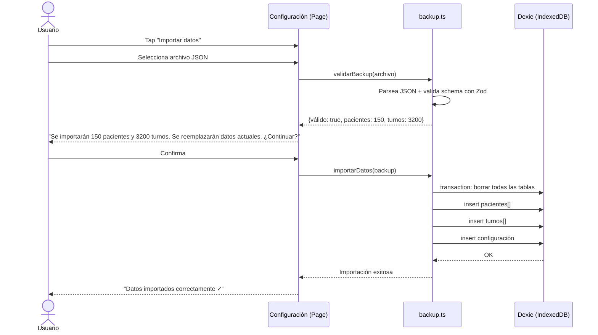

# Diagrama de Secuencia: Importar Backup (US-25)

```mermaid
sequenceDiagram
    actor U as Usuario
    participant C as Configuración (Page)
    participant BS as backup.ts
    participant DB as Dexie (IndexedDB)

    U->>C: Tap "Importar datos"
    U->>C: Selecciona archivo JSON
    C->>BS: validarBackup(archivo)
    BS->>BS: Parsea JSON + valida schema con Zod
    BS-->>C: {válido: true, pacientes: 150, turnos: 3200}
    C-->>U: "Se importarán 150 pacientes y 3200 turnos. Se reemplazarán datos actuales. ¿Continuar?"

    U->>C: Confirma
    C->>BS: importarDatos(backup)
    BS->>DB: transaction: borrar todas las tablas
    BS->>DB: insert pacientes[]
    BS->>DB: insert turnos[]
    BS->>DB: insert configuración
    DB-->>BS: OK
    BS-->>C: Importación exitosa
    C-->>U: "Datos importados correctamente ✓"
```
