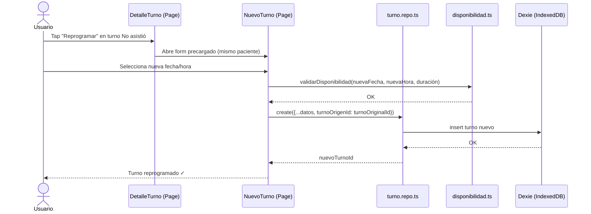

# Diagrama de Secuencia: Reprogramar Turno (US-05)

```mermaid
sequenceDiagram
    actor U as Usuario
    participant D as DetalleTurno (Page)
    participant P as NuevoTurno (Page)
    participant TR as turno.repo.ts
    participant DS as disponibilidad.ts
    participant DB as Dexie (IndexedDB)

    U->>D: Tap "Reprogramar" en turno No asistió
    D->>P: Abre form precargado (mismo paciente)
    U->>P: Selecciona nueva fecha/hora
    P->>DS: validarDisponibilidad(nuevaFecha, nuevaHora, duración)
    DS-->>P: OK
    P->>TR: create({...datos, turnoOrigenId: turnoOriginalId})
    TR->>DB: insert turno nuevo
    DB-->>TR: OK
    TR-->>P: nuevoTurnoId
    P-->>U: Turno reprogramado ✓
```
