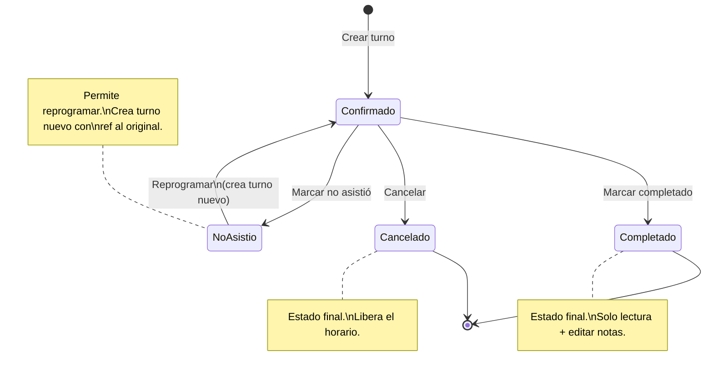

# Diagrama de Estados: Turno

```mermaid
stateDiagram-v2
    [*] --> Confirmado: Crear turno

    Confirmado --> Completado: Marcar completado
    Confirmado --> Cancelado: Cancelar
    Confirmado --> NoAsistio: Marcar no asistió

    NoAsistio --> Confirmado: Reprogramar\n(crea turno nuevo)

    Completado --> [*]
    Cancelado --> [*]

    note right of Completado: Estado final.\nSolo lectura + editar notas.
    note right of Cancelado: Estado final.\nLibera el horario.
    note left of NoAsistio: Permite reprogramar.\nCrea turno nuevo con\nref al original.
```
