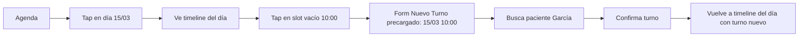

# User Flow: Agendar turno desde el calendario

```mermaid
flowchart LR
    A[Agenda] --> B[Tap en día 15/03]
    B --> C[Ve timeline del día]
    C --> D[Tap en slot vacío 10:00]
    D --> E[Form Nuevo Turno precargado: 15/03 10:00]
    E --> F[Busca paciente García]
    F --> G[Confirma turno]
    G --> H[Vuelve a timeline del día con turno nuevo]
```
