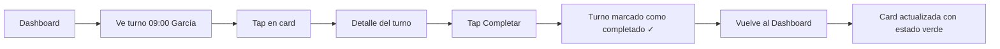

# User Flow: Atender paciente (flujo del día)

```mermaid
flowchart LR
    A[Dashboard] --> B[Ve turno 09:00 García]
    B --> C[Tap en card]
    C --> D[Detalle del turno]
    D --> E[Tap Completar]
    E --> F[Turno marcado como completado ✓]
    F --> G[Vuelve al Dashboard]
    G --> H[Card actualizada con estado verde]
```
