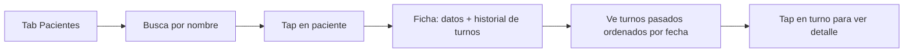

# User Flow: Consultar historial de paciente

```mermaid
flowchart LR
    A[Tab Pacientes] --> B[Busca por nombre]
    B --> C[Tap en paciente]
    C --> D[Ficha: datos + historial de turnos]
    D --> E[Ve turnos pasados ordenados por fecha]
    E --> F[Tap en turno para ver detalle]
```
