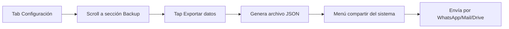

# User Flow: Hacer backup

```mermaid
flowchart LR
    A[Tab Configuración] --> B[Scroll a sección Backup]
    B --> C[Tap Exportar datos]
    C --> D[Genera archivo JSON]
    D --> E[Menú compartir del sistema]
    E --> F[Envía por WhatsApp/Mail/Drive]
```
