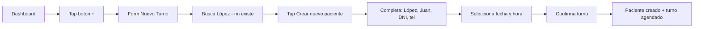

# User Flow: Paciente nuevo por teléfono

```mermaid
flowchart LR
    A[Dashboard] --> B[Tap botón +]
    B --> C[Form Nuevo Turno]
    C --> D[Busca López - no existe]
    D --> E[Tap Crear nuevo paciente]
    E --> F[Completa: López, Juan, DNI, tel]
    F --> G[Selecciona fecha y hora]
    G --> H[Confirma turno]
    H --> I[Paciente creado + turno agendado]
```
